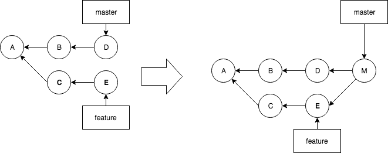

# Codelab: conflicting merge

Things do not always go the way we want. Suppose a file has been changed in another branch, on the same line?
We will have to decide which line is correct. The other branch, my branch, or a combination of both. Clearly,
git cannot merge this automatically, and we will have to tell git how to deal with it.

The situation actually is not different from codelab 02 (we just add another commit on the feature branch). File is changed on both branches, and on merge, a new commit
will be made. Only this time, git will not be able to create the merge automatically.



## 1. Setup (clone)
The setup is identical to codelab 02.

```
git clone https://github.com/switchfully/git-starter-01 starter01
cd starter01
git checkout feature
git checkout master
```

Make a conflicting change on the feature branch:

```
git checkout feature
```

Edit `file.txt`:
```
line 1
line 2
line 3
line 4 <== modified in commit C
line 5
line 6 <== modified in commit E
```

```
git add file.txt
git commit -m "commit E"
git checkout master
```


This is the result (head pointing to master branch):

```
$ git log --all --decorate --oneline --graph
* e913c68 (feature) commit E
* f1212dc commit C
| * 29b35d2 (HEAD -> master) commit D
| * 2e2bf16 commit B
|/  
* 3343e01 commit A
* 207d44e initial
```

## 2. Merge (with conflict)

Make sure you are on the *master* branch. We will merge the *feature* branch into the *master* branch.


```
$ git checkout master
Already on 'master'
$ git merge feature
Auto-merging file.txt
CONFLICT (content): Merge conflict in file.txt
Automatic merge failed; fix conflicts and then commit the result.
```

The CONFLICT notification notifies you that you need to manally correct the conflict.

A git status will tell you more in detail what to do next:

```
$ git status
On branch master
You have unmerged paths.
  (fix conflicts and run "git commit")
  (use "git merge --abort" to abort the merge)

Unmerged paths:
  (use "git add <file>..." to mark resolution)

	both modified:   file.txt

no changes added to commit (use "git add" and/or "git commit -a")
```

So you have to correct `file.txt`, then tell git that you have corrected it by running git commit (after staging `file.txt`).

`file.txt` has the following content:

```
$ cat file.txt
line 1
line 2 <== modified in commit B
line 3
line 4 <== modified in commit C
line 5
<<<<<<< HEAD
line 6 <== modified in commit D
=======
line 6 <== modified in commit E
>>>>>>> feature
```

So on the HEAD (where your are stading, that is *master* branch) there is a conflict on line 6.
HEAD says 'commit D', feature says 'commit E'.
Note also that 'commit C' was a commit on the *feature* branch. That part is already automatically merged.

You could keep and modify line 6 the way you want, remove the '<<<<<', '>>>>>' and '=====' parts, add the file
to stage and commit it.
Now, this seems quite simple, as we made the changes, and we know exactly what we did. Things are much
more complex if a another developer made many changes, and we do not know exactly what he did.

For resolving more complex merges, you need some tooling. Intellij as really nice tools to deal with merge conflct.

* Start IntelliJ (community or ultimate: both have complete git support)
* File > Open > browse to starter01 directory > button Open
* If not present in the task bar: make "Version Control" visible: View > Tool Windows > Version Control
* Below, make sure you are on tab 'Local Changes'
* You will see a 'default changelist' with below 'Merge Conflict'. 'file.txt' is in red.
* Right click 'file.txt' > Git > 'Resolve Conflicts...'
* Click button 'Merge...'
* You know see a window with 3 versions of `file.txt`
** Left: the version on the branch you were merging into. That is the `master`.
** Right: the version on the branch you were merging. That is `feature`.
** Middle: what will be the result of your merge. This is were you work.
* Push the magic button. This will automatically merge the changes that are non-conflicting 
- line 2 (commit B) and line 4 (commit D).
* For line 6: hit on one of the arrows on either side ( x >>) or (<< x) to copy the line over to the middle.
Change line 6 in the middle to '<== modified in commit D and E'. Press the x on the other side. Now IntelliJ knows that this was the latest conflict you resolved.
* Press button "Apply"

The conflict in `file.txt` has been resolved, but Git does not now that yet.
IntelliJ has automatically staged `file.txt` (blue), so the only thing you need to do is telling git that it is resolved by committing it.
* Right-click the file, keep the suggested comment. Commit it.
* A new merge is created on the master branch
