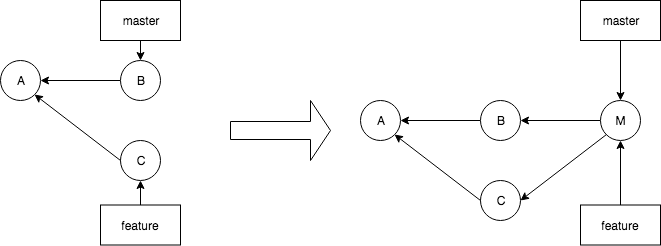

# Codelab: none conflicting merge

This time, we will merge a branch (called *feature*) with the master, while both branches have committed changes.
Using merge, we will create a new commit into the *master* branch, which incorporates the changes of feature-branch.





## 1. Setup (manually)
Create a new directory for this exercise and start a git repo (`git init`).

### Create commit A
Create a file.txt with following contents:
```
line 1
line 2
line 3
line 4
line 5
line 6
```

Commit to the master branch using comment `commit A`

### Create feature branch
*feature*

Create a feature branch `git branch feature`. Keep head pointing to the master branch.

### Create commit B on the master branch

Modify as follows:

```
line 1
line 2 <== modified in commit B
line 3
line 4
line 5
line 6
```

Commit the change to *master* branch using comment `commit B`

### Create commit C on the feature branch

The *head* is currently pointing to the *master* branch. Have it point to the *feature* branch.

`git checkout feature`

Wat would be the contents of `file.txt`?

Modify the file as follows:

```
line 1
line 2
line 3
line 4 <== modified in commit C
line 5
line 6
```

Commit the change to feature branch using comment `commit B`

### Create commit D on the master branch

`git checkout master`

Modify the file as follows:

```
line 1
line 2 <== modified in commit B
line 3
line 4
line 5
line 6 <== modified in commit D
```

`file.txt` is now change on both the *master* branch and the *feature* branch.

Commit the change to master branch using comment `commit D`

### Result

This is the result (head pointing to master branch):

```
$ git log --all --decorate --oneline --graph
* c4b0120 (HEAD -> master) commit D
* 77a4170 commit B
| * 9d8f024 (feature) commit C
|/  
* f6ad194 commit A
```

This is the situation of the first drawing.

## 1bis. Setup (clone from existing git repo)

```
git clone https://github.com/stijnhaezebrouck/codelab-changed-on-branches.git exercise
cd exercise
git checkout feature    <- download feature branch from origin
git checkout master
```

This is the result (head pointing to master branch):

```
$ git log --all --decorate --oneline --graph
* c4b0120 (HEAD -> master) commit D
* 77a4170 commit B
| * 9d8f024 (feature) commit C
|/  
* f6ad194 commit A
```

This can be done if you want to start over from the setup phase.

## 2. Merge

Branch *feature* has diverged from *master*. Both branches have changes to the same file, at different lines.
What will happen if we merge the *feature* branch into the *master* branch? 
* Is it possible?
* Will the file cause a conflict?
* Is a new commit required?
* What will file.txt contain?

As we merge the *feature* branch into the *master* branch, we must checkout the *master* branch first:

```
git checkout master
```

Now merge:

```
$ git merge feature -m "commit M"
Auto-merging file.txt
Merge made by the 'recursive' strategy.
 file.txt | 2 +-
 1 file changed, 1 insertion(+), 1 deletion(-)
```

The following happened:
* git noticed that file.txt was modified in both branched. It automatically merged the file.
* comparing both versions of the file, one line was changed (one insertion + 1 deletion)
* a new commit was made using commit message "commit M". If you would have omitted the -m option, git would have prompted
you for a commit message using the default editor.
* master pointer was updated to commit M.

What happend to file.txt?

```
$ cat file.txt
line 1
line 2 <== modified in commit B
line 3
line 4 <== modified in commit C
line 5
line 6 <== modified in commit D
```

Branch state:
```
$ git log --all --decorate --oneline --graph
*   dd164e7 (HEAD -> master) commit M
|\  
| * 9d8f024 (feature) commit C
* | c4b0120 commit D
* | 77a4170 commit B
|/  
* f6ad194 commit A
```

## 3. Extra

In the diagram on top, the *master* branch and the *feature* branch were pointing to the same commit M.
Here, the *feature* branch is still poiting to commit C. How can you have *feature* point to commit M?
In other words, how can you merge commit M into the  *feature* branch?

Try now merging the *master* branch into the *feature* branch. Will that create again a new commit?