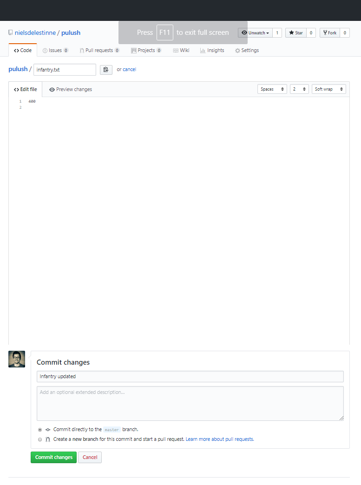

# Codelab: Pull and Push revisited

## 1. Setup

**Let's first set up our remote repository:**

1. On GitHub, or any other service that offers a Git server on which you can create remote repositories, create a new repository.
2. Make sure you have read and write access to it.
3. We'll use this repository in a moment.

**Now, locally:**
1. Create a new directory in which you **initialize** a new git repository.

**Lastly, do the following:**
1. On your local repository, checkout the `master` branch (which should be already the case).
2. Create a file `infantry.txt` with a value of `500` (the amount of infantry) inside.
3. Track the file, make a commit (with message `Commit A - infantry`).
4. Now, push the changes to your remote repository
    - You'll first have to add your remote repository as a `remote`.
    - The remote branch `master` will be automatically created upon pushing
    - Upon pushing, provide the `-u` option, it will automatically set the (newly created) remote-tracking branch `origin/master` as the upstream branch of local, tracking branch `master`.
    
In the end, your project history should like this:
```
* 55fd1f6 (HEAD -> master, origin/master) Commit A - infantry
```

## 2. Push revisited

> Sidenote: pushing from a local branch to a different remote branch (e.g. from local branch `master` to remote branch `branchX`) is really not a common use-case and in general discouraged. 

1. Create a new file,`cannoneers.txt`, add value `20` to it.
2. Start tracking the file, and make a commit with message `Commit B - cannoneers`
3. **Do not yet push!**

Your project's history should look like this:
```
* bf6422e (HEAD -> master) Commit B: cannoneers
* 55fd1f6 (origin/master) Commit A - infantry
```

Now, image this commit should not have been made on branch master, as it is a feature that should not be part of our 'main development branch' (which is `master` in our case).

So, we want to do two things:
1. Have our Commit B be part of another branch (so our changes are not lost)
    - Granted, there is more than one solution for this, we'll choose **option b** (which might not be the best option, but it shows how to use command `push` differently than before)
        1. Create a local feature branch
        2. Create a remote feature branch
        3. Stash our changes (they're not part of a branch, but not lost either)
2. Reset our `master` branch so that it doesn't contain Commit B.

**The plan is as follows:** we are going to push the current local `master` branch to a (newly created) remote branch `feature-cannoneers`. Then, we are going to reset our local `master` branch to commit A.

1. Instead of `git push` or `git push origin master` we are going to execute the following command `git push origin master:feature-cannoneers`. 
    - Thus, we are going to push our local branch `master` to remote (`origin`) branch `feature-cannoneers` (which will be created automatically). 
        ```
        Enumerating objects: 4, done.
        Counting objects: 100% (4/4), done.
        Delta compression using up to 8 threads
        Compressing objects: 100% (2/2), done.
        Writing objects: 100% (3/3), 288 bytes | 288.00 KiB/s, done.
        Total 3 (delta 0), reused 0 (delta 0)
        remote:
        remote: Create a pull request for 'feature-cannoneers' on GitHub by visiting:
        remote:      https://github.com/<username>/<repo-name>/pull/new/feature-cannoneers
        remote:
        To https://github.com/<username>/<repo-name>.git
         * [new branch]      master -> feature-cannoneers
        ```
    - The project history should now look like this:
        ```
        * bf6422e (HEAD -> master, origin/feature-cannoneers) Commit B: cannoneers
        * 55fd1f6 (origin/master) Commit A - infantry
        ```
2. Secondly, we have to reset our local branch `master` so that it points to Commit A (55fd1f6) instead of Commit B (bf6422e). Thus, it should not have any knowledge of file `cannoneers.txt`.
    - Use the following command: `git reset --hard HEAD~`, `git reset --hard HEAD~1` or `git reset --hard 55fd1f6` (the hash of Commit A).
        - What does that command do?
            - Command `reset` will move the branch, to which HEAD is pointing at, to a new commit.
                - Thus `git reset 55fd1f6` will move (if you're on `master`, thus HEAD points to `master`) the `master` branch to commit `55fd1f6`.
                - Command `git reset --hard HEAD~` and `git reset --hard HEAD~1` will move branch `master` (if HEAD is at `master`) to the parent commit of `HEAD` (so one level back (in this case: that will be commit A))
                    - `HEAD~2` will go 2 levels back, `HEAD~3` 3 levels,...
                - The index will be overwritten to resemble your new HEAD.
            - The `--hard` option will make sure the working directory is overwritten (so the changes that were part of commit B (bf6422e) will not be unstaged, they will be really thrown away (in your `master` branch))
3. So now (if you haven't already) execute one of the following commands: `git reset --hard HEAD~`, `git reset --hard HEAD~1` or `git reset --hard 55fd1f6` (with your own hash of Commit A)
    ```
    HEAD is now at 55fd1f6 Commit A - infantry
    ```
4. Your project history should now look like this:
    ```
    * bf6422e (origin/feature-cannoneers) Commit B: cannoneers
    * 55fd1f6 (HEAD -> master, origin/master) Commit A - infantry
    ```
5. Show the working tree status (using `git status`) (there should be no un-staged changes, there should be no trace of `cannoneers.txt` (due to our `--hard` option))
    ```
    On branch master
    Your branch is up to date with 'origin/master'.
    
    nothing to commit, working tree clean
    ```

## 3. Pull revisited

> `git pull` is the combination of command `git fetch` followed by `git merge`.
 
Currently, your project history should look like this:
```
* bf6422e (origin/feature-cannoneers) Commit B: cannoneers
* 55fd1f6 (HEAD -> master, origin/master) Commit A - infantry
```   

We're not going to be bothered with the remote `feature-cannoneers` branch any longer.
- Let's delete it: `git push --delete origin feature-cannoneers`
    ```
    To https://github.com/<username>/<repo-name>.git
     - [deleted]         feature-cannoneers
    ```
    ```
    * 55fd1f6 (HEAD -> master, origin/master) Commit A - infantry
    ```
Now, either on GitHub or GitLab, on the repository page, create a manual new commit:
1. Using your browser, navigate to your GitHub/GitLab repository
2. Click on file `infantry.txt`
3. Edit the file (e.g. change `500` to `400`)
4. Commit the changes (on the `master` branch) with message `Commit X - infantry updated`



Again, just to verify, check your project history:
```
* 55fd1f6 (HEAD -> master, origin/master) Commit A - infantry
``` 
There is not yet any trace of the new Commit X, which was made on the remote branch `master`.

Now, let's fetch the changes (download refs, objects,...) from the `origin` remote.
1. Execute `git fetch origin`, it will download _all the branches and all of their changes_ of remote `origin`.
    - `git fetch origin master` will download _all the changes of branch `master`_ of remote `origin`.
    - In this scenario, both have the same effect.
    ```
    remote: Enumerating objects: 5, done.
    remote: Counting objects: 100% (5/5), done.
    remote: Total 3 (delta 0), reused 0 (delta 0), pack-reused 0
    Unpacking objects: 100% (3/3), done.
    From https://github.com/nielsdelestinne/pulush
       55fd1f6..0a1fb74  master     -> origin/master
    ```
2. Check your project's history
    ```
    * 0a1fb74 (origin/master) Infantry updated
    * 55fd1f6 (HEAD -> master) Commit A - infantry
    ```
    - As you can see, `git fetch` does not yet incorporates (e.g. merges) the changes into our local branch. It simply downloaded the changes.
    
It's now time to merge the changes from `origin/master` into our local branch `master`.
This is really nothing more than just merging one branch into another as you have done before.
1. While on the local branch `master`, merge `origin/master` into it using `git merge origin/master`.
    ```
    Updating 55fd1f6..0a1fb74
    Fast-forward
     infantry.txt | 2 +-
     1 file changed, 1 insertion(+), 1 deletion(-)
    ``` 
2. Now, the project's history should look as follows:
    ```
    * 0a1fb74 (HEAD -> master, origin/master) Infantry updated
    * 55fd1f6 Commit A - infantry
    ```
    
We have successfully downloaded and merged our remote `origin/master` branch into our local branch `master`. The end result is the same as `git pull origin (master)`. Using `fetch` and (e.g.) `merge` instead of `pull` gives us some more fine grained control. 