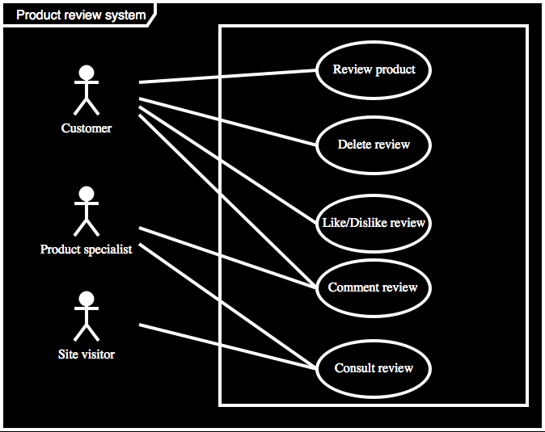
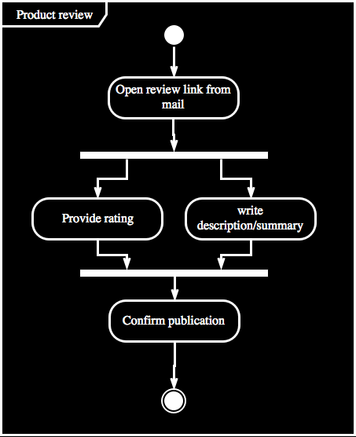
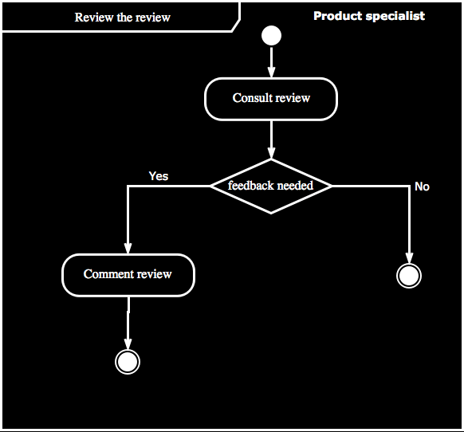
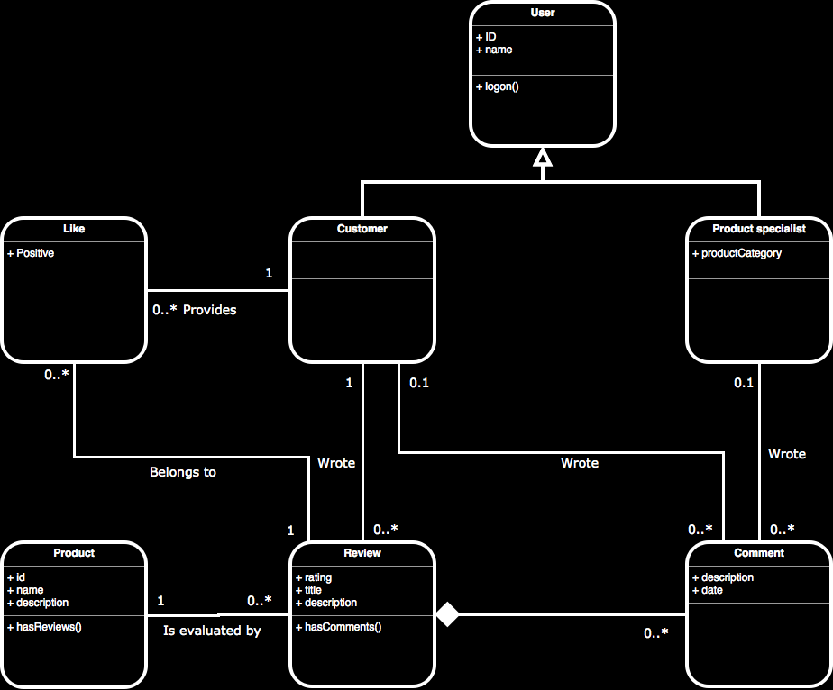

# CODELAB 01

**Disclaimer**
Both analysis and software development are not a hard science. 
Below you can find a possible solution for the stated problem.
Different interpretations of the requirements can result in different valid solutions. 

# UML

Our client **Hotblue** asked us to build a review system for their web shop. Today they already have a complete webshop in production.
The CEO of **Hotblue** strongly believes having customers reviewing and commenting on catalogue items is going to be the future.

When announcing his dream of a new review system he made the following statements

- All customers should be able to review all products
- A review exists of a rating (1-5) a one sentence summary and a textual description
- A customer should be able to delete his own reviews
- A customer can comment on his own reviews or on others reviews
- A product specialist (A **Hotblue** employee) can comment on reviews as well
- A product specialist has a product category assigned
- A customer can like or dislike a review
- A site visitor (no logon) can consult reviews of products

## 1. Create a Use Case Diagram for the product review system

## 2. Create an  Activity diagram (or multiple) for the product review system

Here we created an example activity diagram for a customer reviewing a catalogue product.

Here we created an example activity diagram for Product specialist reviewing a customer review and commenting if needed.

## 3. Create a Class diagram for the product review system

Both Customer and Product Specialist are considered as subclasses of the superclass User. They inherit all attributes and operations.

A comment has a strong lifecycle dependency on a review. Once a review is deletd all related comments are deleted as well.  
  

## 4. Implement the Class diagram and the relations

No solution provided :)
