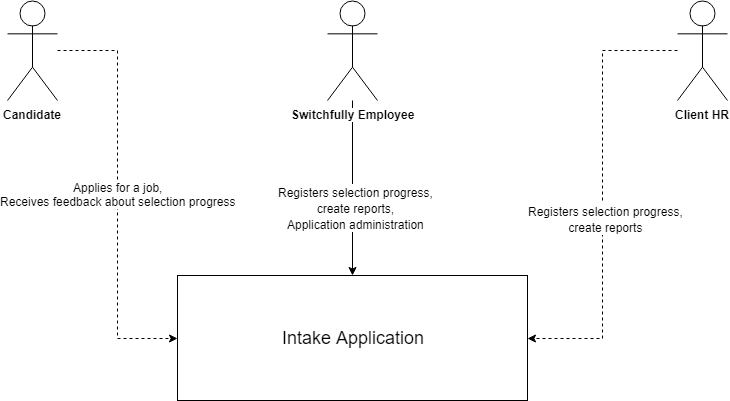
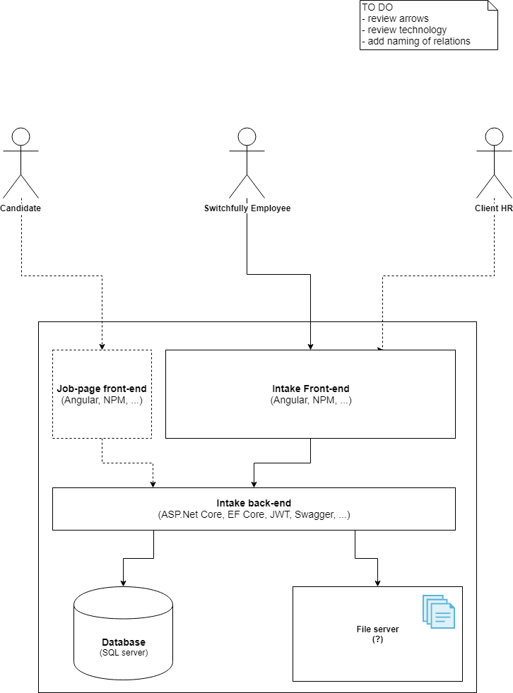

# Intake Application

At Switchfully we aid our customers to select the right profiles to make the Switch to become a modern software developer. 
For us it is very important this selection process should be a pleasant experience for all candidates applying (even those not beeing selected).

Therefore we want to build an **Intake application** to track candidates during the intake/selection process.

## High level analysis

Before the start of the project we typically conduct a High Level Analysis (HLA) phase. 
The goal of this phase is to provide just enough upfront analysis to start the project without defining the complete blueprint of the application.

### Business drivers (The Why)

The main **business drivers** for the application are: 

- A transparent selection process
- Fast and clear feedback
- Easy to use
- Secure

### C4 model

In order to communicate about the architecture of the applications we've chosen to use the C4 Model (Simon Brown).
The diagrams below are a materializitation of ou HLA phase. Feel free to challenge.

#### Context diagram

#### Container diagram

#### Component diagram

**TO DO**

#### Class diagram

**TO DO**

## Non-functional requirements

### Project constraints

- Follow the SCRUM framework
    - Project kickoff
    - Sprint kickoff
    - Daily standup (rotating SCRUM master role 0.5 sprint)
    - Backlog refinement sessies (including product owner)
    - Sprint review (Sprint backlog overview + Demo)
    - Retrospective 
- Deliverables (Physical or digitized)
    - Project backlog (up to date!) (user stories, technical tasks, ...)
    - Sprint backlog (estimated + commitment)
    - A clean Scrum board (sprint backlog, user stories, technical tasks, story leads/pairs, impediments, ... )
    - Definition Of Done
    - Evolving Domain model
    - C4 model (Context, Container, Component)
    - A build monitor dashboard

### Technology constraints

- Create a new GitHub repository 
- Use REST (with JSON as the message / body format)
- Use ASP.NET Core Web Api
- Use AzureDevops for continuous integration
- Perform logging (use logging provided by .NET Core)
    - Certainly log all interactions with the application that can be defined as "errors"
            - E.g.: unauthorized access, illegal arguments, exceptions in general,...
- Use Swagger to provide a readable document of your WebApi

## Functional requirements

[Switchfully intake app](hhttps://dev.azure.com/Switchfully-Intake/Switchfully-intake-app "Azure DevOps")

