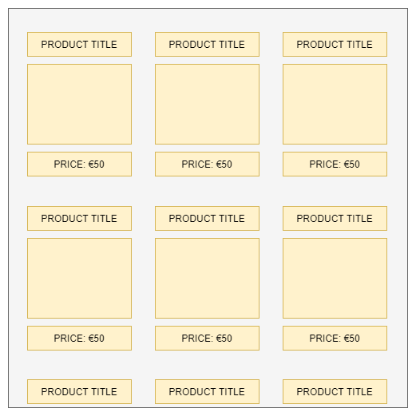
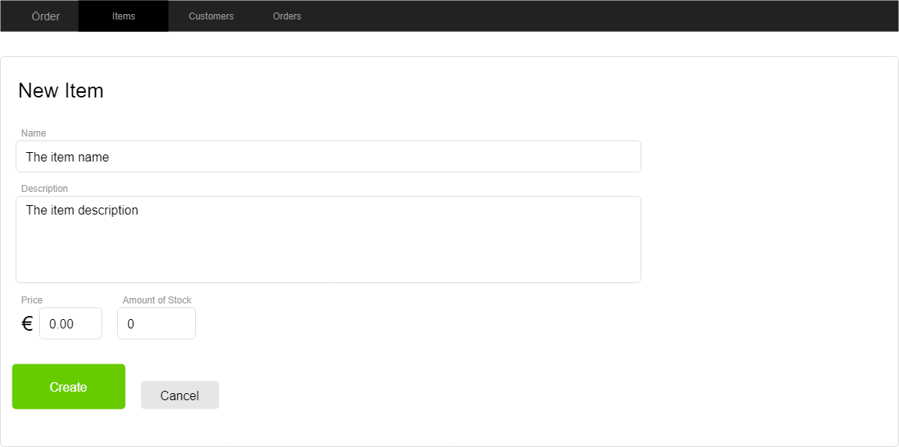
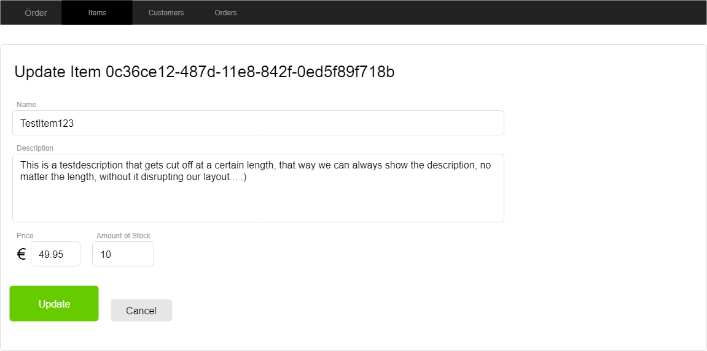
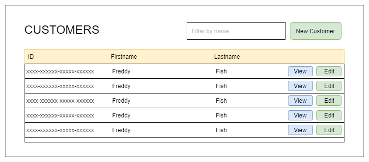

# Örder GUI

Good news! We're hired to develop the frontend of the Örder application!

As the backend, use an already existing implementation! We can provide you with one.
- Run the backend locally, you'll frontend (GUI) will have to call its REST endpoints.

**Remark 1**:
We have provided mock-ups to give you some inspiration. However, you are free to deviate from them. 

**Remark 2**:
You don't have to bother about authentication or authorization. However, if you like, you can implement it as well. 
You'll have to implement a registration and sign-in form / screen for this.

## Requirement 1: Item overview

We want to see an overview of all the items. 

The items should be shown in a grid layout as is a popular approach in web-shops.

For each item, show:
- Name
- Price
- A box that is a placeholder for an image.

_No pagination is required_

## Requirement 2: Create item

We want to be able to create items, one at a time. 

The following information should always be provided:
- Name
- Description
- Price
- Amount of (initial) Stock

_A negative (or 0) price ot negative stock amount should not be allowed._

After successfully creating an item, redirect the user to the item detail page (should still be empty). 

## Requirement 3: Item Detail Page

We want to view all details of a single item.
- By directly navigating to a url that contains the id of the item, I want to view all the details of that item.
- By clicking on an item's name in the item overview, I want to redirect to the item's details page.

The following information should be present on the item's detail page
- Id
- Name
- Description
- Price
- Amount of (initial) Stock

_No changes to the data can be made here_

## Requirement 4: Item Edit Page
We want to be able to edit a single item.

The following data should be allowed to edit:
- Name
- Description
- Price
- Amount of (initial) Stock

Extra (not optional)
- Add an 'Edit' button on the Item detail's page that, upon being clicked, redirects to the item's edit page.
- After updating the changes, redirect to the detail page, it should show the new changes.

## Requirement 5: Customer overview

We want to see an overview of all the customers. 

The customers should be shown in a list.

For each item, show:
- Id
- firstname
- lastname

Implement a filter by option that filters (frontend-only) the results based on the lastname. 

## Requirement 6: Create customer

We want to be able to create customers, one at a time. 

The following information should always be provided:
- firstName
- lastName
- email (value object)
- address (value object)
- phoneNumber (value object)

After successfully creating an customer, redirect the user to the customer detail page (should still be empty).

## Requirement 7: Customer Detail Page

We want to view all details of a single customer.
- By directly navigating to a url that contains the id of the customer, I want to view all the details of that customer.
- By clicking on an customer's view button in the customer overview, I want to redirect to the customers' details page.

The following information should be present on the customers' detail page
- id
- firstName
- lastName
- email (value object)
- address (value object)
- phoneNumber (value object)

_No changes to the data can be made here_

## Requirement 8: Customer Edit Page
We want to be able to edit a single customer.

The following data should be allowed to edit:
- firstName
- lastName
- email (value object)
- address (value object)
- phoneNumber (value object)

Extra (not optional)
- Add an 'Edit' button on the Customer's detail's page that, upon being clicked, redirects to the customer's edit page.
- After updating the changes, redirect to the detail page, it should show the new changes.
- On the Customer's overview page, every edit button should navigate to the correct page.

## Requirement 9: Order items

Allow for a way to let a customer shop for items. How you do this, is up to you.
However, your implementation should support the following:
- Add 1 or more items to a shopping cart
- Specify the quantity of an item
- Calculate the price
- Once done with shopping, submit the order

## Requirement 10: Overview of orders

Show an overview of all the orders. Again, it's up to you how you do this.

## Requirement 11: Order report

For a customer, show in a visual appealing way, all of its orders (the report). 
