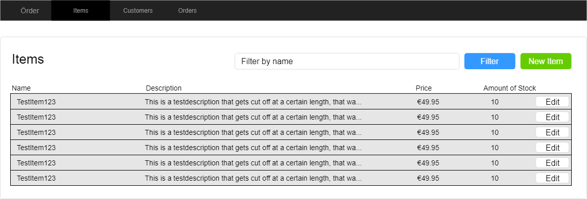

Örder GUI

Good news! We're hired to develop the frontend of the Örder application!

- As the backend, use the [Order-JPA-solution](https://github.com/switchfully/order-jpa-solution) project
    - Clone (directly or using your fork) this project.
    - Run it locally, you'll frontend (GUI) will have to call its REST endpoints.
- A setup / skeleton project is available on the Switchfully GitHub. However, you can set it up yourself as well. The decision is up to you.

# Requirements

1. Start with Items
    1. Create an item overview screen
    2. Create an item creation screen 
    3. Crate an item update screen
2. Should you be done with Items, do one of the following:
    1. Either, continue with customers and then orders.
    2. Or, secure the Örder backend using Basic Authentication, then update your frontend to perform authenticated calls.
3. Use the mocks as a reference. Customers and Orders are similar to Items

## Mocks

1. Items overview

2. Create new Item

3. Update existing Item

