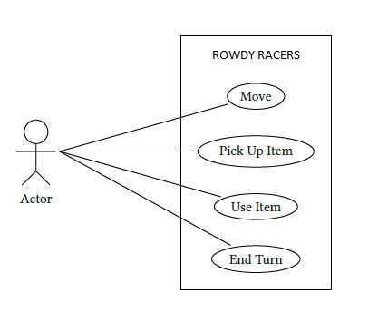

# Rowdy Racers

You're about to create a turn-based game called **Rowdy Racers**

## Technical tips for JAVA
- Use Java Swing or JavaFX to create the GUI
    - JavaFX, it's the big/better brother, successor of Java Swing.
- Seperate the domain from the GUI: the domain should not contain any GUI code. The GUI should not contain any of the Rowdy Racer rules (the GUI just needs to draw visual things to the screen)
    - (Optionally: You can look into the MVC (Model-View-Controller) design pattern to help you with this)
        - (The following code example should make it a bit more clear: [MVC explained](https://www.tutorialspoint.com/design_pattern/mvc_pattern.htm))
        - (Or, check the Head-First Design Pattern book that is (hopefully) located near you.)
    
## Technical tips for .NET
- Use WPF (Windows specific)
- Seperate the domain from the GUI: the domain should not contain any GUI code. The GUI should not contain any of the Rowdy Racer rules (the GUI just needs to draw visual things to the screen)
    - Create multiple projects in one solution to properly achieve this
    - Look into MVVM
        - https://intellitect.com/getting-started-model-view-viewmodel-mvvm-pattern-using-windows-presentation-framework-wpf/

## Description of Rowdy Racers

**Disclaimer**: This is a difficult exercise, it will definitely take you more than 1 day to make it 'work'! 
It will take you more than a week to solve it properly... :)

There are multiple iterations of Rowdy Racers, meaning that in a new iteration additional features might be requested, 
or existing behavior / features needs to be modified.

Start with the first iteration, the first iteration is written down below, in the remainder of this file.

Only when you're finished with this iteration, take a look at the next iteration. 
It's in `/Iterations/NextIterations01/Readme.md`

Good luck, have fun.

### Rowdy Racers
Rowdy Racers is game that is played on a grid. Each of two players try to
reach their target before the other player does.

#### GUI

You'll have to create a (visual) GUI that resembles the following mockup:

### 1. Actions
The game is turn-based. During each turn, a player is allowed to perform 3 individual actions.
The kind of each action can be chosen by the player. The following kinds of actions are supported:

1. The first kind of action is to move.
2. The second kind of action is to pick up an item.
3. The third kind of action is to use an item
4. The fourth kind of action is to end the turn. In this case, an empty action is performed for
each remaining action in the turn.

#### Move action - Extra information
- During a single action, a player can move one square in any direction (vertical,
horizontal, and diagonal).
- No two players can occupy the same square at the same time.
- A player cannot occupy a square that is occupied by a wall.
- A player cannot leave the grid.
- When a player moves, he leaves a light trail behind on his previous square. The light
trail remains active during 2 additional actions. After that, the light trail disappears.
Therefore, the maximum length of the light trail is 3 squares.
- A player cannot cross any light trail: he cannot enter a square that contains a light
trail, and he cannot pass through a diagonal light trail.
- A player is not allowed to end the turn on the square that he started the turn on.
- If a player cannot move during his turn, he is trapped and loses the game.
- If a player reaches the starting position of his opponent, he wins the game.

#### Pick up action - Extra information
- A player can only pick up an item that is placed on the same square as the player.
- A player can carry at most six items.

#### Use item action - Extra information
- A player can only use an item that is in his inventory.

### 2. The Grid
The grid on which the game is played has a rectangular shape for which the size can be configured
when the game is started. The minimum grid size is 10x10. Player 1 starts on the bottom
left corner of the grid, player 2 starts on the top right corner. The finish for each player is the
starting location of the other player.

### 3. Walls
At the start of the game, walls are placed on the grid. A wall forms a barrier that a player cannot
cross.

1. Walls are placed either horizontal or vertical, and have a width of 1 square.
2. The direction of each wall is chosen randomly.
3. The minimal length of a wall is two squares.
4. The maximum length (in terms of the numbers of squares that it covers) of a vertical
(horizontal) wall is 50% of the vertical (horizontal) size of the grid, rounded up to an
integer value.
5. The number of walls is chosen randomly.
6. There is at least 1 wall.
7. At most 20% of the squares in the grid, rounded up to an integer value, is covered by a
wall.
8. A wall cannot cover the starting position of a player.

### 4. Items
Light grenades are items that can be picked up and used by a player.

1. When a player uses a light grenade, the light grenade is removed from his inventory and
placed on the current square of the player. Initially, the light grenade is inactive. The light
grenade becomes active when the player leaves the square.
2. An active light grenade is invisible and cannot be picked up.
3. A player cannot use multiple light grenades on the same square.
4. When any player enters a square with an active light grenade, it explodes. The player that
moved on the light grenade is blinded and loses his next 3 actions
5. An exploded light grenade is not active.
6. Active and exploded light grenades cannot be picked up.

## Class Diagram, more specifically: The Domain Model

## Use Case diagram

