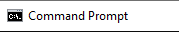

= Command line
== Presentation commandline

=== What?
A way to communicate to your system without using the UI.

=== Why does it exist?
It's the original system.

Before you had an OS like windows you could only interact with the system using commandline.

That's why you can do almost everything in commandline.

=== Why use it?

* It is fast to type a command.
* It executes fast.
* You know most of the time exactly what something does.
* Easy to script or to configure.
* Complete control!

=== Different types?
Because it used to be the core business of an OS, every OS has it own commands and way of working.

You'll be mostly working with Linux-based commands and Windows based command.

With Git-bash you can use a lot of linux commands in Windows (but not all!).

Command Prompt was never designed properly so most of the commands don't work as well.

We prefer using Git-bash or Windows Powershell.

image::assets/powershell.png[]

=== What can you do with it?
With bash you can do almost everything:

* installing programs
* downloading links
* creating and modifying files
* you name it.

Let's get you through the basics!

== Exercises

=== General
. Exercises
.. print out "hello world"
.. save "hello world" in a variable named World
.. print out that variable
.. clear your terminal
.. save "hello world!" in the same World variable (hint: you can use the arrow keys to find back your original command)
.. print out the the World variable again
.. save "byebye" in a variable Goodbye and print the content of that variable in one line.

=== Navigation
. Exercises
.. Find your location in the file system
.. navigate to the root folder
.. display the contents of the root folder
.. Go back to your home folder
.. print out the contents of your home folder
.. print out the modification date of the files in your home folder
.. print out all the hidden folders in your home folder
.. navigate to your appData folder
.. push the appData folder unto the stack
.. go back to the root folder
.. pop the appData folder of the stack

=== File management
. Exercises
.. create a file grocery-list.txt in your home folder
.. add '1kg tomatoes' to your grocery list
.. add '2 lemons' to your grocery list
.. print out the contents of grocery-list.txt
.. make a directory 'shopping'
.. copy grocery-list.txt into the shopping directory
.. rename the grocery list in the shopping directory to list.txt
.. do a search on your grocery list and find the line with tomatoes
.. open the list in vi and add '6 bottles of water' to the list
.. try to quit vi
.. print out the contents of your list
.. create a new file named John's grocery list
... give it "This is John's grocery list. It is the best list of all." as content.
..

=== Web
. Exercises
.. lookup the ip-address of switchfully.com
.. do a call to https://switchfully-funiversity.herokuapp.com/professors and print out the answer
.. do the same call but this time saved the result in a file professors.txt
.. do the same call but save only the line with "Darwin" in a file called darwin.txt

